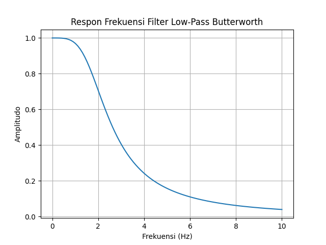
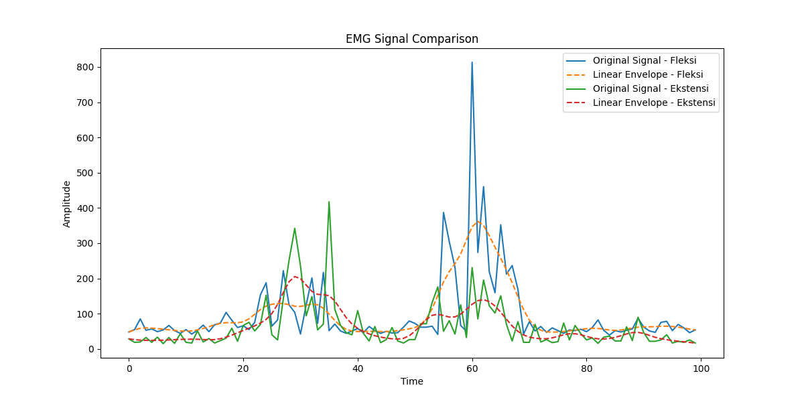

# Pembahasan Project

## Ekstraksi Fitur Menggunakan Linear Envelope Algoritm
Linear Envelope adalah teknik pengolahan sinyal yang digunakan untuk menghaluskan data EMG, memperjelas fitur utama dari sinyal, dan mengurangi noise. Teknik ini melibatkan dua langkah utama: menghitung nilai absolut dari sinyal dan menerapkan filter low-pass.

Filter low-pass diimplementasikan menggunakan metode Butterworth, yang dirancang untuk memiliki respons frekuensi yang sangat halus di dalam pita lewat. Rumus untuk filter Butterworth orde ke-n adalah:

$$ H(f) = { 1 \over \sqrt{1+({f \over fc})} 2n}$$

di mana: <br>
- H(f) = fungsi transfer filter
- f = frekuensi sinyal
- fc = frkuensi cutoff
- n = orde filter

### implementasinya dan Hasil
Dalam proyek ini, filter Butterworth diterapkan dengan parameter cutoff=2, fs=20, dan order=2. Proses ini mengubah data EMG asli menjadi bentuk yang lebih halus dan konsisten, yang lebih cocok untuk analisis lanjutan.
```python
cutoff = 2 # Nilai Cutoff = 2
fs = 20 # Nilai Frekuensi Sampling = 20
orde = 2 # Nilai orde filter = 2
```
#### Analisa
- Frekuensi cutoff rendah pada 2 Hz dipilih untuk menghaluskan sinyal EMG. Sinyal EMG biasanya mengandung komponen frekuensi tinggi yang merupakan noise. Dengan memilih frekuensi cutoff yang rendah, filter efektif dalam menghilangkan noise frekuensi tinggi ini, sambil mempertahankan karakteristik dasar dari sinyal otot.
- Frekuensi sampling 20 Hz (diasumsikan dari konteks) menunjukkan bahwa data EMG dicatat pada 20 sampel per detik. Frekuensi Nyquist, yang merupakan setengah dari frekuensi sampling, adalah 10 Hz. Memilih cutoff yang jauh lebih rendah dari frekuensi Nyquist membantu dalam menghindari efek aliasing dan mempertahankan integritas sinyal asli.
- Filter orde 2 menunjukkan bahwa fungsi transfer filter memiliki pangkat 2. Ini menghasilkan respon frekuensi yang cukup halus tanpa terlalu banyak overshoot atau ringing. Filter orde yang lebih tinggi dapat menyebabkan efek tak diinginkan seperti ringing, sementara orde yang lebih rendah mungkin tidak cukup efisien dalam menghaluskan noise.
- Pengaruh parameter-parameter ini pada respon frekuensi filter dapat ditunjukkan dengan menghitung fungsi transfer filter dan memplot respon frekuensinya. hal ini dibuktikan dengan menggunakan fungsi transfer filter
$$ H(f) = { 1 \over{1+({f \over fc})  2 n} } $$
Denganfc=2Hz, n=2, kita dapat menghitung dan memplot H(f) untuk menunjukkan bagaimana filter meredam frekuensi di atas 2 Hz.

```python
import numpy as np
import matplotlib.pyplot as plt

fc = 2  # Frekuensi cutoff
n = 2   # Orde filter
f = np.linspace(0, 10, 100)  # Membuat array frekuensi dari 0 hingga 10 Hz

H = 1 / np.sqrt(1 + (f / fc)**(2 * n))  # Menghitung fungsi transfer

plt.plot(f, H)
plt.title('Respon Frekuensi Filter Low-Pass Butterworth')
plt.xlabel('Frekuensi (Hz)')
plt.ylabel('Amplitudo')
plt.grid(True)
plt.show()

```

dengan hasil plotting diatas yakni sebagai berikut:


### Hasil

1. Linear Envelope merupakan teknik pemrosesan sinyal yang digunakan untuk menghaluskan data EMG. Proses ini melibatkan dua langkah utama:
   1. Menghitung nilai absolut dari sinyal EMG, yang menghilangkan informasi tentang polaritas sinyal namun menangkap intensitas aktivitas otot.
   2. Menerapkan filter low-pass untuk menghaluskan sinyal absolut. Filter ini membantu dalam mengurangi noise dan fluktuasi cepat dalam data, 
2. Filter low-pass yang digunakan dalam kasus memiliki cutoff frequency 2 Hz dan order 2, yang menunjukkan penekanan pada fluktuasi frekuensi tinggi dan penonjolan sinyal pada frekuensi rendah.
3. Perbandingan antara nilai data "Fleksi" dan "Ekstensi" sebelum dan setelah penerapan Linear Envelope menunjukkan bahwa proses ini telah menstabilkan dan menghaluskan data.
4. Ekstraksi fitur dengan Linear Envelope telah berhasil menghaluskan data EMG, mengurangi noise, dan menonjolkan tren utama dalam sinyal. Ini bisa sangat berguna dalam meningkatkan interpretasi dan analisis sinyal EMG.

## Neural Network (NN)

Pada proyek yang menggunakan sensor EMG, peran (NN) Neural Network ini digunakan untuk membantu dalam menginterpretasikan sinyal untuk mengidentifikasi pola gerakan tertentu memalui jenis gerakan atau intensitas kontraksi otot.

### Peran Neural Network Pada Proyek Ini
1. Interpretasi Sinyal EMG <br>
   Menginterpretasikan sinyal sinyal untuk mengidentifikasi pola gerakan atau intensitas otot.
2. Klasifikasi Gerakan
   Mengklasifikasi jenis gerakan berdasarkan pola sinyal EMG, membedakan kontraksi otot atau gerakan anggota tubuh

### Kegunaan Neural Network Untuk Proyek Ini
1. Kontrol Prostetik <br>
   Menginterpretasi sinyal EMG dari otot-otot yang tersisa pada pengguna, memungkinkan kontrol prostetik yang lebih alami dan intuitif.
2. Rehabilitas Medis <br>
   Menganalisis bagaimana otot-otot berkontraksi dan bergerak, membantu dalam merancang program rehabilitasi yang lebih efektif.
3. Pelacakan dan Analisis Gerakan <br>
   Membantu dalam menganalisis gerakan untuk meningkatkan kinerja atletik atau untuk tujuan pelatihan.

### Fungsi Pada Neural Network
1. Ekstraksi Fitur <br>
   Mengidentifikasi fitur penting dari sinyal EMG yang berisik dan kompleks, yang bisa sulit dilakukan dengan metode analisis tradisional.
2. Pembelajaran Data <br>
   NN dapat belajar dari data EMG yang besar untuk meningkatkan akurasi dan keefektifan dalam mengklasifikasikan atau menginterpretasi sinyal.
3. Generalisasi <br>
   Menggdapat disesuaikan dan dioptimalkan untuk berbagai jenis aplikasi EMGeneralisasi dari data latih untuk mengenali pola dalam data baru, yang penting dalam aplikasi dunia nyata di mana variasi sinyal EMG bisa sangat luas.
4. Adaptabilitas <br>
   NN dapat disesuaikan dan dioptimalkan untuk berbagai jenis aplikasi EMG, mulai dari kontrol perangkat hingga analisis kesehatan.

