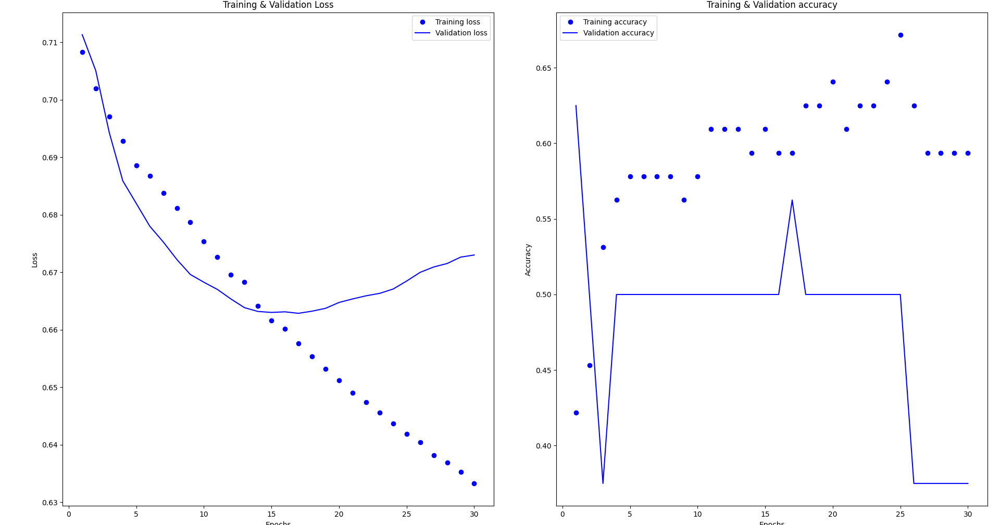
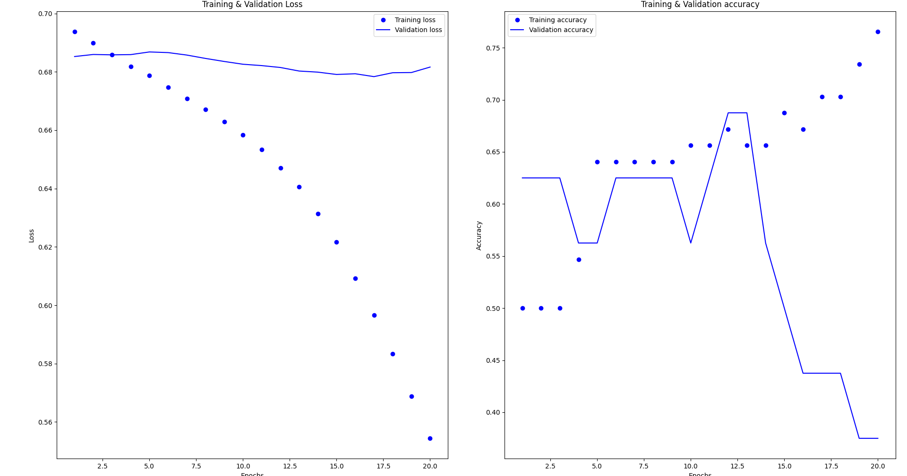
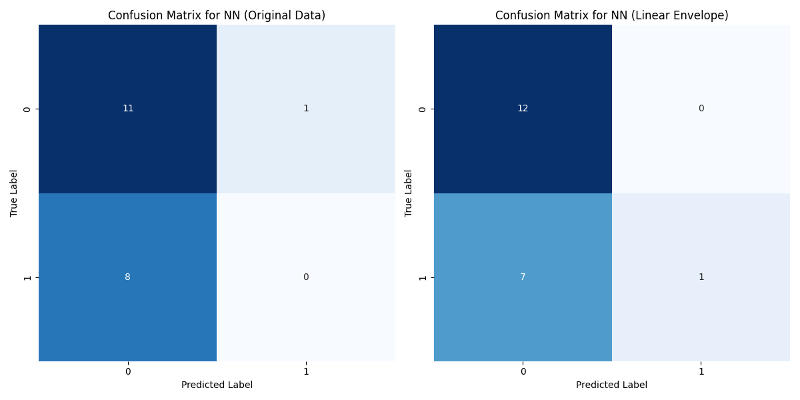
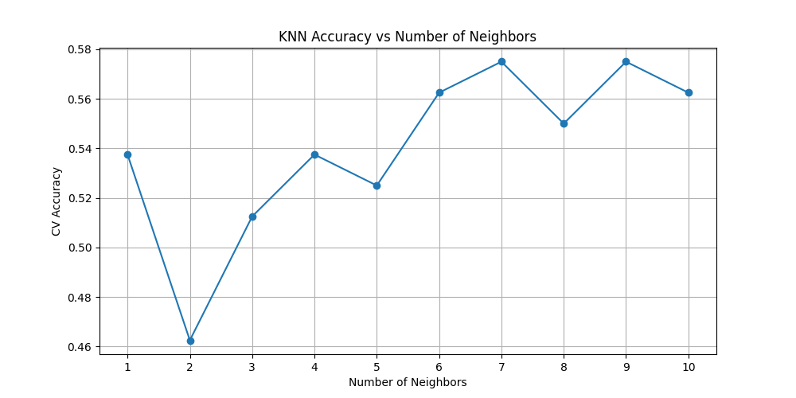
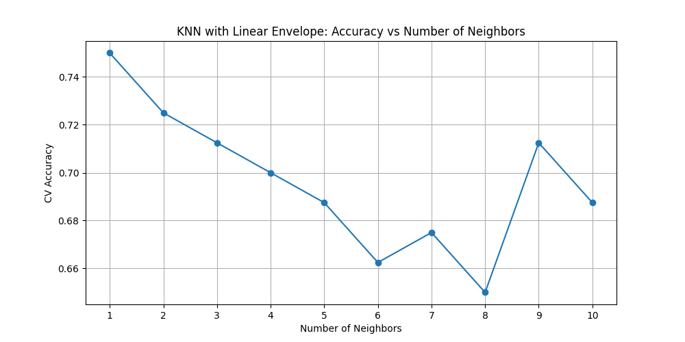
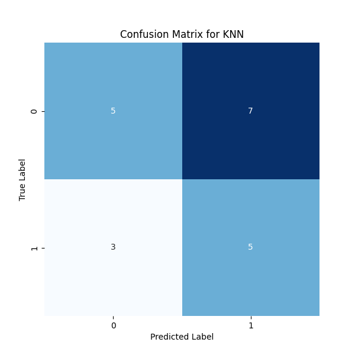
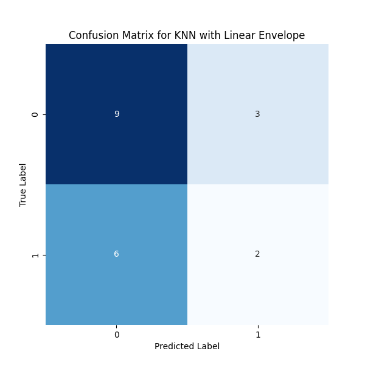

# Pembahasan Project

## Ekstraksi Fitur Menggunakan Linear Envelope Algoritm
Linear Envelope adalah teknik pengolahan sinyal yang digunakan untuk menghaluskan data EMG, memperjelas fitur utama dari sinyal, dan mengurangi noise. Teknik ini melibatkan dua langkah utama: menghitung nilai absolut dari sinyal dan menerapkan filter low-pass.

Filter low-pass diimplementasikan menggunakan metode Butterworth, yang dirancang untuk memiliki respons frekuensi yang sangat halus di dalam pita lewat. Rumus untuk filter Butterworth orde ke-n adalah:

$$ H(f) = { 1 \over \sqrt{1+({f \over fc})} 2n}$$

di mana: <br>
- H(f) = fungsi transfer filter
- f = frekuensi sinyal
- fc = frkuensi cutoff
- n = orde filter

### implementasinya dan Hasil
Dalam proyek ini, filter Butterworth diterapkan dengan parameter cutoff=2, fs=20, dan order=2. Proses ini mengubah data EMG asli menjadi bentuk yang lebih halus dan konsisten, yang lebih cocok untuk analisis lanjutan.
```python
cutoff = 2 # Nilai Cutoff = 2
fs = 20 # Nilai Frekuensi Sampling = 20
orde = 2 # Nilai orde filter = 2
```
#### Analisa
- Frekuensi cutoff rendah pada 2 Hz dipilih untuk menghaluskan sinyal EMG. Sinyal EMG biasanya mengandung komponen frekuensi tinggi yang merupakan noise. Dengan memilih frekuensi cutoff yang rendah, filter efektif dalam menghilangkan noise frekuensi tinggi ini, sambil mempertahankan karakteristik dasar dari sinyal otot.
- Frekuensi sampling 20 Hz (diasumsikan dari konteks) menunjukkan bahwa data EMG dicatat pada 20 sampel per detik. Frekuensi Nyquist, yang merupakan setengah dari frekuensi sampling, adalah 10 Hz. Memilih cutoff yang jauh lebih rendah dari frekuensi Nyquist membantu dalam menghindari efek aliasing dan mempertahankan integritas sinyal asli.
- Filter orde 2 menunjukkan bahwa fungsi transfer filter memiliki pangkat 2. Ini menghasilkan respon frekuensi yang cukup halus tanpa terlalu banyak overshoot atau ringing. Filter orde yang lebih tinggi dapat menyebabkan efek tak diinginkan seperti ringing, sementara orde yang lebih rendah mungkin tidak cukup efisien dalam menghaluskan noise.
- Pengaruh parameter-parameter ini pada respon frekuensi filter dapat ditunjukkan dengan menghitung fungsi transfer filter dan memplot respon frekuensinya. hal ini dibuktikan dengan menggunakan fungsi transfer filter
$$ H(f) = { 1 \over{1+({f \over fc})  2 n} } $$
Denganfc=2Hz, n=2, kita dapat menghitung dan memplot H(f) untuk menunjukkan bagaimana filter meredam frekuensi di atas 2 Hz.

```python
import numpy as np
import matplotlib.pyplot as plt

fc = 2  # Frekuensi cutoff
n = 2   # Orde filter
f = np.linspace(0, 10, 100)  # Membuat array frekuensi dari 0 hingga 10 Hz

H = 1 / np.sqrt(1 + (f / fc)**(2 * n))  # Menghitung fungsi transfer

plt.plot(f, H)
plt.title('Respon Frekuensi Filter Low-Pass Butterworth')
plt.xlabel('Frekuensi (Hz)')
plt.ylabel('Amplitudo')
plt.grid(True)
plt.show()

```

dengan hasil plotting diatas yakni sebagai berikut:


### Hasil

1. Linear Envelope merupakan teknik pemrosesan sinyal yang digunakan untuk menghaluskan data EMG. Proses ini melibatkan dua langkah utama:
   1. Menghitung nilai absolut dari sinyal EMG, yang menghilangkan informasi tentang polaritas sinyal namun menangkap intensitas aktivitas otot.
   2. Menerapkan filter low-pass untuk menghaluskan sinyal absolut. Filter ini membantu dalam mengurangi noise dan fluktuasi cepat dalam data, 
2. Filter low-pass yang digunakan dalam kasus memiliki cutoff frequency 2 Hz dan order 2, yang menunjukkan penekanan pada fluktuasi frekuensi tinggi dan penonjolan sinyal pada frekuensi rendah.
3. Perbandingan antara nilai data "Fleksi" dan "Ekstensi" sebelum dan setelah penerapan Linear Envelope menunjukkan bahwa proses ini telah menstabilkan dan menghaluskan data.
4. Ekstraksi fitur dengan Linear Envelope telah berhasil menghaluskan data EMG, mengurangi noise, dan menonjolkan tren utama dalam sinyal. Ini bisa sangat berguna dalam meningkatkan interpretasi dan analisis sinyal EMG.

## Neural Network (NN)

Pada proyek yang menggunakan sensor EMG, peran (NN) Neural Network ini digunakan untuk membantu dalam menginterpretasikan sinyal untuk mengidentifikasi pola gerakan tertentu memalui jenis gerakan atau intensitas kontraksi otot.

### Peran Neural Network Pada Proyek Ini
1. Interpretasi Sinyal EMG <br>
   Menginterpretasikan sinyal sinyal untuk mengidentifikasi pola gerakan atau intensitas otot.
2. Klasifikasi Gerakan
   Mengklasifikasi jenis gerakan berdasarkan pola sinyal EMG, membedakan kontraksi otot atau gerakan anggota tubuh

### Kegunaan Neural Network Untuk Proyek Ini
1. Kontrol Prostetik <br>
   Menginterpretasi sinyal EMG dari otot-otot yang tersisa pada pengguna, memungkinkan kontrol prostetik yang lebih alami dan intuitif.
2. Rehabilitas Medis <br>
   Menganalisis bagaimana otot-otot berkontraksi dan bergerak, membantu dalam merancang program rehabilitasi yang lebih efektif.
3. Pelacakan dan Analisis Gerakan <br>
   Membantu dalam menganalisis gerakan untuk meningkatkan kinerja atletik atau untuk tujuan pelatihan.

### Fungsi Pada Neural Network
1. Ekstraksi Fitur <br>
   Mengidentifikasi fitur penting dari sinyal EMG yang berisik dan kompleks, yang bisa sulit dilakukan dengan metode analisis tradisional.
2. Pembelajaran Data <br>
   NN dapat belajar dari data EMG yang besar untuk meningkatkan akurasi dan keefektifan dalam mengklasifikasikan atau menginterpretasi sinyal.
3. Generalisasi <br>
   Menggdapat disesuaikan dan dioptimalkan untuk berbagai jenis aplikasi EMGeneralisasi dari data latih untuk mengenali pola dalam data baru, yang penting dalam aplikasi dunia nyata di mana variasi sinyal EMG bisa sangat luas.
4. Adaptabilitas <br>
   NN dapat disesuaikan dan dioptimalkan untuk berbagai jenis aplikasi EMG, mulai dari kontrol perangkat hingga analisis kesehatan.

### Neural Network Architecture
- Input Layer: Ukuran sesuai dengan jumlah fitur pada dataset.
- Hidden Layers: Dua lapisan dense dengan 10 neuron masing-masing, menggunakan aktivasi ReLU.
- Output Layer: Satu neuron dengan aktivasi Sigmoid untuk klasifikasi biner.
- **ReLU Activation**: Mempercepat konvergensi dan mengatasi masalah vanishing gradient.
- **Sigmoid pada Output**: Cocok untuk tugas klasifikasi biner, memberikan probabilitas output.

### Cara Kerja Neural Network
1. Arsitektur Lapisan: Neural Network terdiri dari lapisan input, satu atau lebih lapisan tersembunyi, dan lapisan output. Setiap lapisan terdiri dari unit atau neuron yang terhubung dengan lapisan sebelumnya dan berikutnya.
2. Fungsi Aktivasi: Setiap neuron dalam jaringan menggunakan fungsi aktivasi untuk menentukan outputnya. Dalam kode Anda, fungsi aktivasi 'relu' digunakan di lapisan tersembunyi, dan 'sigmoid' digunakan di lapisan output. 'Relu' membantu mengatasi masalah vanishing gradient, sedangkan 'sigmoid' ideal untuk output biner.
3. Feedforward dan Backpropagation: Dalam proses pelatihan, NN menggunakan mekanisme feedforward untuk mengirimkan input melalui jaringan dan menghasilkan output. Kemudian, melalui backpropagation, jaringan menyesuaikan bobotnya berdasarkan kesalahan (perbedaan antara output yang diprediksi dan aktual).
4. Pembelajaran: Proses pembelajaran di NN melibatkan penyesuaian berulang bobot dan bias di dalam jaringan berdasarkan data pelatihan, biasanya menggunakan algoritma seperti gradient descent.
5. Evaluasi: Setelah pelatihan, NN dievaluasi pada set data pengujian untuk mengukur kinerjanya, sering kali menggunakan metrik seperti akurasi, presisi, dan recall.


### Hasil dan Evaluasi
#### Input Langsung Menggunakan Data

#### Input Menggunakan Hasil Ekstraksi

#### Hasil Konfusion Matriks


- Akurasi pada data pengujian: 60%.
- Matriks Konfusi:
  - Kelas 0: Sukses diklasifikasikan.
  - Kelas 1: Gagal diklasifikasikan.

### Kesimpulan
- Model memerlukan penyesuaian arsitektur atau teknik pra-pemrosesan untuk meningkatkan kemampuan klasifikasi pada kedua kelas.
- Pertimbangan untuk penambahan lapisan atau neuron untuk meningkatkan kapasitas model dalam menangkap fitur yang lebih kompleks.
- Eksplorasi teknik regularisasi untuk mengurangi risiko overfitting.

## KNN (K-Nearest Neighbors)
KNN adalah algoritma machine learning yang digunakan untuk klasifikasi dan regresi. Dalam konteks data EMG, tujuan utama KNN adalah untuk mengklasifikasikan gerakan pergelangan tangan menjadi dua kategori: fleksi dan ekstensi.

### Peran KNN Pada Proyek Ini
Dalam analisis data EMG, KNN berperan sebagai metode untuk memahami pola yang ada dalam data sinyal EMG dan memprediksi jenis gerakan berdasarkan pola tersebut. KNN memanfaatkan kesamaan antar sampel untuk membuat prediksi.

### Fungsi Utama KNN
1. `KNeighborsClassifier(n_neighbors=3)`: Membuat instance KNN dengan 3 neigbors terdekat. Angka ini menentukan jumlah neigbors yang digunakan untuk memprediksi kelas dari titik data baru.
2. `GridSearchCV`: Digunakan untuk menemukan parameter n_neighbors yang optimal. GridSearchCV secara sistematis bekerja melalui kombinasi parameter yang berbeda, memberikan cara yang efisien untuk melakukan 'tuning' pada model untuk mencapai performa terbaik.
3. `fit()`: Metode ini digunakan untuk melatih model KNN pada data latih. Ini memungkinkan model untuk 'belajar' dari data sehingga bisa membuat prediksi yang akurat pada data baru.
4. `predict()`: Setelah model dilatih, metode ini digunakan untuk membuat prediksi pada data pengujian.
5. `accuracy_score`: Menghitung akurasi model, yaitu proporsi prediksi yang benar dibandingkan dengan jumlah total prediksi.

### Cara Kerja KNN
1. Memilih Jumlah Neighbors (K): KNN memulai dengan pemilihan jumlah neighbors. Ini penting karena jumlah neigbors akan mempengaruhi keputusan klasifikasi model.
2. Menghitung Jarak: Untuk setiap titik data yang ingin diklasifikasikan, KNN menghitung jarak antara titik data tersebut dan setiap titik lain dalam set pelatihan.
3. Menentukan neigbors Terdekat: KNN kemudian mengidentifikasi K neighbors terdekat, yaitu K titik dalam set pelatihan yang memiliki jarak terpendek dari titik yang sedang diprediksi.
4. Pemungutan Suara untuk Klasifikasi: Dalam kasus klasifikasi, KNN melakukan pemungutan suara berdasarkan label dari K neigbors terdekat tersebut. Kelas yang paling banyak muncul di antara neigbors terpilih menjadi prediksi klasifikasi untuk titik data yang sedang dipertimbangkan.
5. Optimasi dengan GridSearchCV: digunakan untuk menemukan nilai K yang optimal dengan mencoba berbagai nilai dan mengevaluasi kinerja model menggunakan validasi silang.
6. Evaluasi Model: Setelah model dilatih dan parameter terbaik ditemukan, model tersebut digunakan untuk membuat prediksi pada data pengujian dan kemudian mengevaluasi kinerja model menggunakan metrik seperti akurasi dan matriks konfusi.

### Arsitektur dari KNN
Dalam konteks machine learning, KNN (K-Nearest Neighbors) tidak memiliki "arsitektur" dalam cara yang sama seperti Neural Network karena KNN bukan merupakan model yang berbasis pada "jaringan" atau "lapisan." Namun, beberapa komponen kunci mendefinisikan cara kerja KNN:
1. Jumlah Tetangga (Neighbors) (K): Ini adalah parameter utama dalam KNN, `n_neighbors` diatur dalam `KNeighborsClassifier(n_neighbors=3)`, yang berarti model akan mempertimbangkan tiga tetangga terdekat untuk membuat prediksi.
2. Pemilihan Jarak: Meski tidak secara eksplisit disebutkan dalam kode program, KNN menggunakan ukuran jarak (biasanya jarak Euclidean) untuk mengidentifikasi K tetangga terdekat dari sebuah titik data.
3. Algoritma Voting: KNN membuat keputusan berdasarkan sistem voting mayoritas dari tetangga terdekat. Kelas yang paling sering muncul di antara K tetangga adalah kelas yang dipilih untuk titik data yang diprediksi.
4. GridSearchCV untuk Optimasi: GridSearchCV untuk menemukan nilai K terbaik. Ini merupakan pendekatan untuk mencari secara sistematis parameter terbaik yang meningkatkan kinerja model.


### Hasil
#### Input Langsung Menggunakan Data

#### Input Menggunakan Hasil Ekstraksi

#### Konfusion Matriks by Data

#### Konfusion Matriks by Extraction

### Analisa
1. Pada saat pra-pemrosesan, data telah dinormalisasi, yang penting untuk KNN karena algoritma ini sensitif terhadap skala fitur. Normalisasi membantu dalam menghindari bias terhadap fitur dengan rentang yang lebih besar.
2. Hasil yang didapatkan pada Model KNN terbaik dengan n_neighbors = 7 memiliki skor validasi silang rata-rata sebesar 0.575.Akurasi pada data pengujian adalah 0.5, menunjukkan bahwa model dapat memprediksi dengan benar 50% dari sampel. Matriks konfusi menunjukkan bahwa model memiliki kesulitan yang relatif seimbang dalam mengklasifikasikan kedua kelas (0 dan 1), dengan sedikit kecenderungan lebih baik dalam mengidentifikasi kelas 1.
3. Penggunaan Linear Envelope menghasilkan n_neighbors optimal = 1 dengan skor validasi silang 0.75, yang lebih baik dibandingkan dengan data asli. Akurasi pada data pengujian meningkat menjadi 0.55. Matriks konfusi menunjukkan peningkatan dalam mengklasifikasikan kelas 0 dibandingkan dengan model sebelumnya, tetapi masih ada kesulitan dalam mengklasifikasikan kelas 1.
4. Untuk data asli, presisi, recall, dan F1-score untuk kedua kelas cukup seimbang, menunjukkan bahwa model tidak memiliki bias signifikan terhadap salah satu kelas. Untuk data dengan Linear Envelope, terdapat peningkatan dalam presisi dan recall untuk kelas 0, tetapi penurunan untuk kelas 1.


### Kesimpulan
1. Linear Envelope tampak nyata meningkatkan performa KNN pada data EMG, terutama dalam mengidentifikasi kelas 0. Ini menunjukkan bahwa proses ekstraksi fitur ini mungkin membantu dalam menonjolkan ciri-ciri penting dari sinyal EMG untuk analisis klasifikasi.
2. Pemilihan n_neighbors sangat krusial dalam KNN. Pada data asli, model membutuhkan lebih banyak neigbors untuk generalisasi yang baik, sementara pada data dengan Linear Envelope, hanya satu neigbors yang memberikan hasil terbaik. Ini bisa menunjukkan bahwa Linear Envelope membantu dalam membuat pola data lebih terdefinisi dengan baik.
