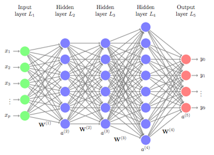
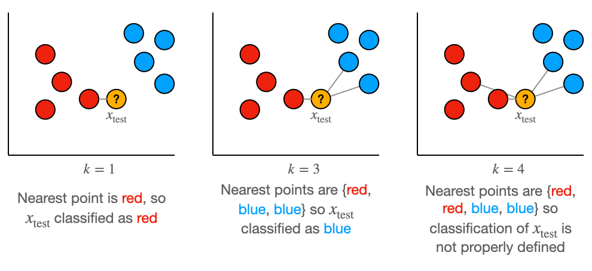

# Quesyen

## Diagram
<b>Neural Network</b>  
  
<b>K-Nearest Neighbors</b>  

Cara kerja dan konsep metode bisa dibayangkan dengan kedua gambar tersebut.

### Bagaimana implementasi NN nya dari sinyal EMG ?
1. <b>Pra-pemrosesan</b>  
   Data EMG biasanya memerlukan pra-pemrosesan, seperti normalisasi dan mungkin penapisan untuk mengurangi noise.
2. <b>Ekstraksi Fitur</b>  
   Dapat termasuk langkah-langkah seperti Linear Envelope, RMS, atau FFT untuk mengubah data mentah menjadi fitur yang lebih informatif.
3. <b>Arsitektur NN</b>   
   Termasuk lapisan input (sesuai jumlah fitur), beberapa lapisan tersembunyi, dan lapisan output dengan satu neuron (untuk klasifikasi biner) dengan aktivasi sigmoid.
4. <b>Pelatihan</b>   
   Melibatkan penyediaan data EMG (input) dan label gerakan (output) kepada NN. Model 'belajar' dengan menyesuaikan bobotnya untuk meminimalkan kesalahan prediksi.

### Bagaimana implementasi KNN nya dari sinyal EMG ?
1. <b>Pra-pemrosesan</b>  
   Data EMG biasanya memerlukan pra-pemrosesan, seperti normalisasi dan mungkin penapisan untuk mengurangi noise.
2. <b>Tidak Memerlukan Ekstraksi Fitur Kompleks</b>  
   KNN tidak memerlukan transformasi fitur yang kompleks. Data mentah atau sedikit diolah bisa langsung digunakan.yang lebih informatif.
3. <b>Pemilihan K dan Jarak</b>   
   Menentukan jumlah neigbors (K) dan metrik jarak (seperti Euclidean) untuk klasifikasi.
4. <b>Klasifikasi Berdasarkan Tetangga Terdekat</b>   
   KNN mengklasifikasikan titik data baru berdasarkan mayoritas kelas dari K tetangga terdekatnya.

### Cara Kerja NN pada EMG ?
1. <b>Feedforward </b>   
   Input data EMG diumpankan melalui jaringan, di mana setiap lapisan mengaplikasikan bobot, bias, dan fungsi aktivasi. 
2. <b>Backpropagation</b>   
   Kesalahan antara prediksi dan label sebenarnya digunakan untuk menyesuaikan bobot secara bertahap, biasanya dengan metode seperti gradient descent.

### Cara Kerja KNN pada EMG ?
1. <b>Pengukuran Jarak</b>  Untuk titik data baru, KNN mengukur jaraknya ke titik-titik dalam dataset pelatihan.
2. <b>Pemungutan Suara</b>  KNN mengklasifikasikan titik data baru ke kelas yang paling sering muncul di antara K tetangga terdekatnya.
   
### Outputnya bearti dalam bentuk apa ?
Berupa klasifikasi dari jenis gerakan (misalnya, fleksi atau ekstensi). Ini biasanya dalam bentuk biner (0 atau 1) atau probabilitas kelas.

### Bagaimana untuk parameter akurasi, performanya contohnya seperti apa ?
- Akurasi: Persentase total prediksi yang benar. Tinggi akurasi menunjukkan bahwa model sering membuat prediksi yang tepat.
- Presisi dan Recall: Penting untuk mengevaluasi dalam konteks data yang tidak seimbang. Presisi adalah proporsi positif yang diprediksi yang benar, sementara recall adalah proporsi positif sebenarnya yang benar diprediksi.
- F1-Score: Harmonik mean dari presisi dan recall, memberikan keseimbangan antara keduanya.
- Matriks Konfusi: Memberikan gambaran rinci tentang kinerja model, menunjukkan kesalahan tipe I dan II.  

<b>Contoh Performa</b>
Contoh Performa:

- Jika NN atau KNN memiliki akurasi 90%, ini berarti 90% dari total prediksi yang dibuat oleh model adalah benar.
- F1-score yang tinggi menunjukkan bahwa model memiliki keseimbangan yang baik antara presisi dan recall.
